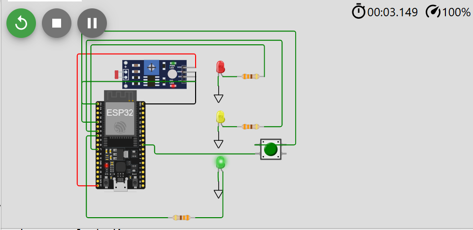
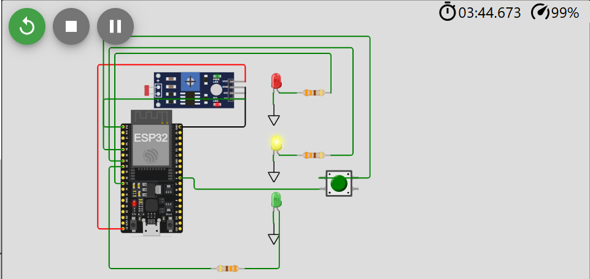
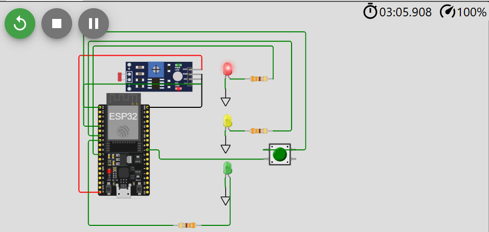
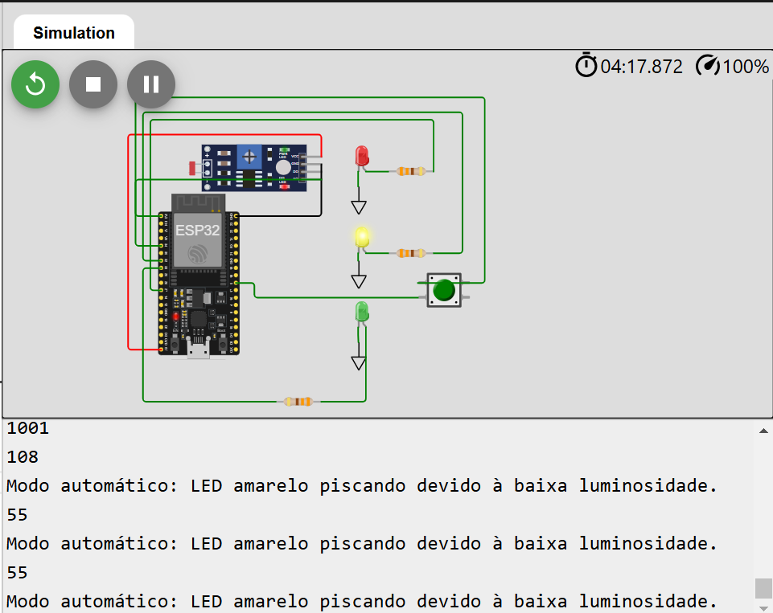
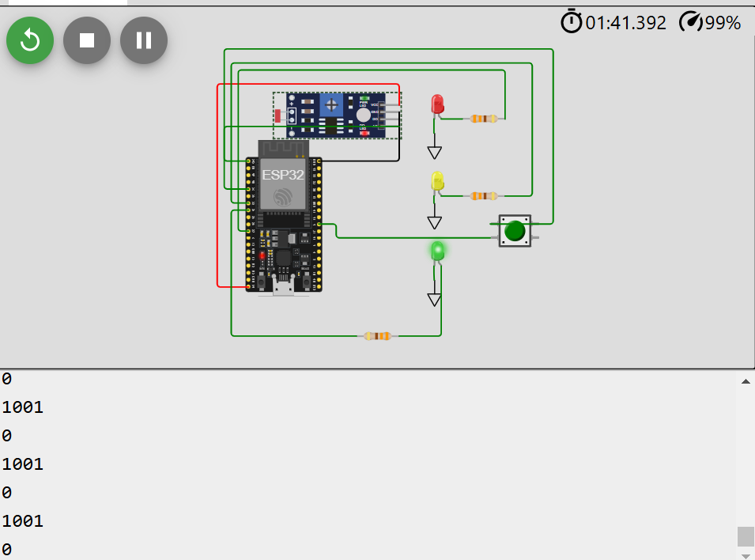

# Semáforos Inteligentes
O desafio dessa prova foi desenvolver um código para o desenvolvimento de um semáforo inteligente, capaz de identificar quando está à noite e ativar seu modo noturno (o LED amarelo ficar piscando a cada 1 segundo) e funcionar normalmente durante o dia, com exceção de um controle inteligente para abrir o sinal verde ao pressionar um botão, quando o sinal estiver no vermelho.

## Estado normal

LED Verde Aceso 
 

LED Amarelo Aceso 
 

LED Vermelho Aceso 
 

## Modo noturno
Defini o limite para o modo noturno ser ativado com uma luminosidade abaixo de 500 e inseri uma mensagem no monitor serial para ficar claro quando o modo noturno estiver ativado, sendo assim, temos:

LED Vermelho Aceso 
 

## Botão pressionado
Adicionei uma lógica com millis() para remover o boucing do botão, mas não consegui cumprir o objetivo de fazer ele acender o LED verde enquanto estivesse com o LED vermelho aceso.

Botão 
 

